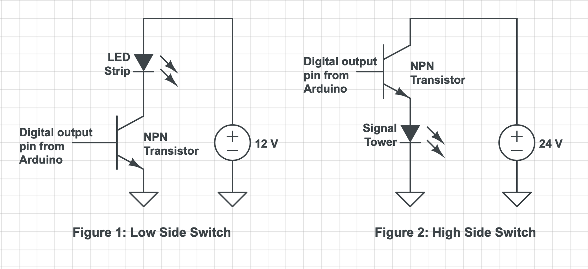

# Signal Tower Control & Automation

## Project Overview

This Arduino sketch allows direct and remote control of a PATLITE signal tower, specifically a LE-FBP model I picked up at a flea market for $10.  Key features include:
- 24V DC operation (required by the PATLITE LE-FBP)
- Direct control of each light in the tower, separately
- Use of MQTT both to remotely set the state (on or off) of any light in the tower and to report state changes in any light
- MQTT operations consistent with Home Assistant integration, allowing the signal tower to be monitored and controlled via Home Assistant, including turning any light in the tower on and off individually. 

## Signal Tower Operations
I could not find a product datasheet for the PATLITE LE-FBP but was able to puzzle out its operation through comparison with information provided in the [datasheet](https://www.patlite.com/support/enddata/catalog/lme-cat-en.pdf) for the LME series product.  Note that my LE-FBP is not equivalent to the LME series, so the wiring is not identical but instead what is described below:

The PATLITE LE-FBP wiring harness provides a separate control wire for each light in the tower.  The tower's built-in controller is capable of driving five different lights -- red, amber, green, blue, and clear, and can determine dynamically (through a clever analog wiring scheme) which lights are present in any installation as well as where they are in the stack.  Turning any light on requires applying 24V to the appropriate control wire. All lights share a common ground connection.

My signal tower works as follows (NOTE: Yours may be different!):

| Wire color (PATLITE) | Wire function |
| ---------- | ---------- |
| Black | Ground (common for all lights) |
| Grey | 24VDC Supply |
| Red | 24VDC to illuminate the Red light |
| Orange | 24VDC to illuminate the Amber light |
| Green | 24VDC to illuminate the Green light |
| Blue | 24VDC to illuminate the Blue light |
| White | 24VDC to illuminate the Clear light |
| Violet | 24VDC to activate Buzzer #1 |
| Skyblue | 24VDC to activate Buzzer #2 |
| Brown | 24VDC Flashing Common |

Turning on any light means applying 24VDC to the appropriate control wire (with 24VDC also supplied to the grey common wire) and with the black wire connected to ground.

## Hardware Control

This control setup here is not what I was familar with in using low voltage microcontrollers to drive higher voltage loads, e.g. using a 5V Arduino to control a 12V LED strip.  In those situations the lower voltage microcontroller output drives the base of an NPN transistor that has its emitter connected to ground and the LED strip connected between the 12V suppply and the transistor's collector as shown in Figure 1 below.  This is called a "low side switch" because the transistor is serving as a digital switch and is on the low (ground) side of the load.  Clearly this wouldn't work for my PATLITE signal tower as I need to digitally turn on and off the 24V supply to each light's control wire separately.

Instead the PATLITE signal tower is an example of needing a "high side switch", with the  transistor (switch) between the supply voltage and the signal tower light (load), as shown in Figure 2 below.
(Looking at this another way, for a low side switch each load has its own separate ground circuit and shares a common supply voltage connection, and for a high side switch each load has its own separate supply voltage circuit and shares a common ground connection.)

Fortunately the high side switch use case is quite common, to the point that it is supported by readily available integrated circuits like the Toshiba TBD62783A, which combines eight such high side switch drivers on a single 18-pin IC.  You'll find Toshiba's [application note](https://toshiba.semicon-storage.com/info/TBD62783APG_application_note_en_20160516_AKX00417.pdf?did=35900&prodName=TBD62783APG) for the TBD62783A provides all the necessary details including a great application circuit example in driving LEDs in high side switch configuration.

To use lights in flashing mode, the PATLITE internal controller generates a special 24VDC feed it supplies via  the brown wire. If you connect lights to the brown 24VDC supply they will blink in unison, as opposed to feeding them from the continuously on 24VDC feed (grey wire).

## Sketch Usage Notes

My PATLITE LE-FBP came with only four lights -- red, amber, green and blue, so the sketch is designed around controlling those four lights  Everything here would work for more or fewer lights, however, with suitable modifications to the sketch.

I used an [Adafruit ESP32 Feather V2](https://www.adafruit.com/product/5400) so pin connections and some aspects of the code reflect that device.

### Basic Wiring

Four digital outputs from the microcontroller, in my case pins 14, 15, 32 and 33 are fed to inputs on four high side switches on the TBD62783A. The outputs of those switches are connected to the individual lamp leads in the PATLITE wiring harness.

The TBD62783A also takes 24VDC from an external supply on its VCC pin.  To power the Feather ESP32 V2 a Traco Power [TSR 1-2450E](https://www.tracopower.com/model/tsr-1-2450e) DC-to-DC converter generates 5VDC from the 24VDC supply.  (I initially used a LM7805 voltage regulator to power the ESP32 but found it got uncomfortably hot resistively dissipating the nineteen volt drop from 24VDC to 5VDC. Happily the TSR 1-2450E is a drop-in replacement for the LM7805.)

### MQTT Integration

While I could have built some form of automated light animation into the sketch to produce a self-contined device, I wanted the ability to remotely control individual lights in tower.  Having used MQTT for other home automation projects it was easy to incorporate MQTT topic-based remote activation of each light as well as the entire tower, as well as topic-based reporting of stage changes in any light.  The sketch establishes a publish and subscribe topic for each light as well as for the entire tower, with topic syntax defined at the top of the sketch.

To provide proper real-time generation and receipt of MQTT messages the sketch uses the MQTT processing loop features of the [Adafruit MQTT library](https://github.com/adafruit/Adafruit_MQTT_Library) with callbacks to handle receiving remote commands (via subscribe) and sharing stage changes (via publish) for each light and for the entire tower.

### Home Assistant Integration

While any MQTT broker and remote client could be used to interoperate with the sketch, I'm already using Home Assistant with the Mosquitto MQTT add-on.  I devised an appropriate addition to the Home Assistant YAML configuration file to allow Home Assistant to recognize each of the four lights in the signal tower and be able to control them through additions to the Home Assistant UI.  The YAML configuration information is provided in a comment at the beginning of the sketch, and will need to be modified to reflect whatever topic syntax is used for other deployment environments.

### Secrets

Wifi network parameters and MQTT broker settings are expected to be provided in a separate `secrets.h` header file.  A template for that file is provided here as `secrets_template.h`, which should be copied and modified to create a `secrets.h` file appropriate for the target deployment environment.

